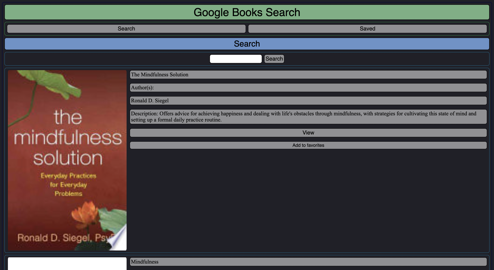

# Google Books Search

## Table of Contents
[Link](#Link)  
[Technologies](#Technologies)  
[Description](#Description)  
[Screenshot](#Screenshot)  
[License](#License)  
[Contact](#Contact)

## Link
https://sheltered-ocean-65878.herokuapp.com/

## Technologies
HTML, CSS, Javascript, MERN, React.js, MongoDB, Mongoose

## Description
A react webpage that uses the Google Books API to provide a search engine for all of the books Google has made available. Users can make searches to access Google Books and add books to their favorites. This allows users to access and keep track all of the available books that peak their interest, all in one integrated site.

## Screenshot

## License
MIT

## Contact
Dalton Wilkins - daltongh@gmail.com
